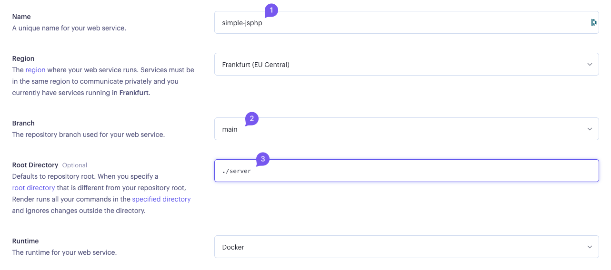

# Tutoriel de mise en production d'une application avec un serveur PHP et un client React

Ce guide vous expliquera comment déployer un serveur PHP sur Render et une base de données sur AlwaysData, ainsi que comment mettre en production un client React sur Netlify.

## Configuration de la base de données avec AlwaysData

### Création d'un compte et d'une base de données

1. **Inscription sur AlwaysData**:

    - Visitez [AlwaysData](https://www.alwaysdata.com/fr/) et créez un compte.

2. **Création d'une base de données MySQL**:
    - Connectez-vous à votre tableau de bord AlwaysData.
      
    - Cliquez sur `MySQL` dans la section `Base de données`.
    - Cliquez sur `Ajouter une base de données`.
    - Entrez un nom pour votre base de données et validez.
    - Notez le nom de la base de données ainsi que les informations de connexion, qui vous seront nécessaires ultérieurement.

### Accès à la base de données via phpMyAdmin

Pour visualiser et gérer votre base de données via une interface graphique, utilisez phpMyAdmin :

-   Accédez à phpMyAdmin depuis votre tableau de bord AlwaysData.
    
-   Utilisez le nom d'utilisateur et le mot de passe que vous avez définis lors de la création de la base de données pour vous connecter.
    

## Mise en production du serveur PHP sur Render

### Création d'un compte sur Render

-   Inscrivez-vous ou connectez-vous sur [Render](https://render.com/).

### Déploiement de votre application

1. **Configuration du déploiement**:

    - Une fois connecté, cliquez sur `New` puis sur `Web Service`.
      
    - Sélectionnez `Build and deploy from a Git repository`.
      
    - Choisissez le dépôt Git que vous souhaitez déployer.

2. **Réglages de déploiement**:

    - Nommez votre service.
    - Sélectionnez la branche à déployer (généralement la branche `main`).
    - Définissez le `Root Directory` à `./server`, là où se trouve votre serveur PHP.
      
      

3. **Configuration des variables d'environnement**:

    - Ajoutez les variables suivantes pour connecter votre serveur à la base de données AlwaysData : - `DB_HOST`: L'adresse de votre base de données. - `DB_NAME`: Le nom de votre base de données. - `DB_USER` et `DB_PASSWORD`: Les identifiants créés lors de la configuration de la base de données.
      

4. **Lancement du service**:
    - Cliquez sur `Create Web Service` pour démarrer le déploiement.

## Mise en production du client React sur Netlif

### Configuration de Netlify

1. **Création d'un compte sur Netlify**:

    - Visitez [Netlify](https://www.netlify.com/) et créez un compte ou connectez-vous.

2. **Déploiement de l'application React**:
    - Cliquez sur `Add new site`, puis `Import an existing repository`.
    - Sélectionnez `Github` comme fournisseur et autorisez Netlify à accéder à vos repo.
    - Trouvez et sélectionnez le dépôt de votre projet React.
      
    - Netlify configurera automatiquement les étapes de build en fonction de votre projet.
    - Cliquez sur `Deploy site` pour lancer le déploiement.

## Conclusion

Vous avez maintenant déployé un serveur PHP sur Render, une base de données sur AlwaysData et un client React sur Netlify. Votre application est désormjsona en production et accessible à tous. N'hésitez pas à consulter la documentation de chaque service pour en savoir plus sur les fonctionnalités avancées.

## Annexe

-   [Documentation AlwaysData](https://help.alwaysdata.com/)
-   [Documentation Render](https://render.com/docs)
-   [Documentation Netlify](https://docs.netlify.com/)
-   [Repository GitHub](https://github.com/GorskiAnthony/template_jsphp)
